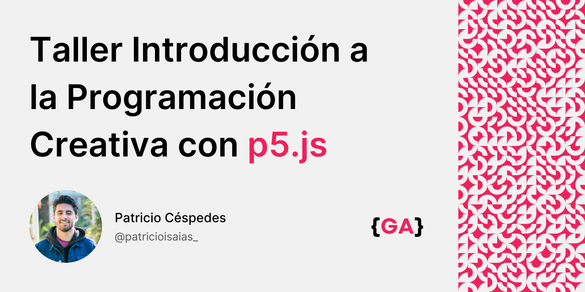

# Introducción a la Programación Creativa con p5.js

Bienvenido/a al taller **Introducción a la Programación Creativa con p5.js**. En este respositorio encontrarás toda la información y recursos relacionados a esta actividad.

## 🔍 Información

- **Duración:** 2 horas
- **Fecha, hora, lugar y coste:** Revisar nuestras redes en [Generative Academy](https://www.instagram.com/generative.academy/)
- **Instructor:** [Patricio Céspedes](https://patricio-isaias.super.site/), Artista Multimedia, Licenciado en Artes mención Composición Musical

## 🎯 Objetivo

El objetivo de este taller es introducirte a las posibilidades de la programación para dar vida a tus ideas creativas. Ya seas artista, diseñador o simplemente alguien interesado en la intersección entre el arte y la tecnología, esta actividad está diseñada para ti. En el camino, repasaremos los fundamentos de la programación, como variables, funciones, condicionales y la incorporación de aleatoriedad. Al final de este taller, estarás familiarizado con las funciones básicas de p5.js y habrás completado un dibujo generativo interactivo que podrás compartir en la web.

## 💻 Materiales

- Laptop (Windows, macOS, Linux) con conexión a Internet
- Navegador web: Se recomienda [Google Chrome](https://www.google.com/intl/es_es/chrome/)
- Editor de Código (Opcional): [Visual Studio Code](https://code.visualstudio.com/) con la extensión [Live Server](https://marketplace.visualstudio.com/items?itemName=ritwickdey.LiveServer).

_Nota: Asegúrate de tener Google Chrome instalado y Visual Studio Code con la extensión Live Server configurada antes del taller._

## 📝 Inscripción

Para participar en este taller, sigue estos pasos:

1. Completa el [Formulario de Inscripción]() **antes del 14 de Noviembre de 2023.**
2. Una vez enviado el formulario, recibirás una **confirmación** por correo electrónico.
3. **Verifica tu correo electrónico** para asegurar tu participación.

Si tienes alguna pregunta adicional, no dudes en ponerte en contacto con nosotros en [generativeacademy@gmail.com](mailto:generativeacademy@gmail.com).

## 📖 Programa

### Parte 1: Introducción a p5.js

#### Introducción al Taller (15 minutos)

- Presentación del instructor y sus proyectos.
- ¿Qué es la programación creativa?
- Casos de estudio (artistas y proyectos destacados).

#### Trabajando con p5.js (45 minutos)

- ¿Qué es p5.js? (breve historia y contexto).
- Demostración del editor en línea y documentación.
- Configuración del entorno de desarrollo en Visual Studio Code.
- Creación de un dibujo utilizando las siguientes funciones básicas de p5.js: `setup()` `draw()` `createCanvas()` `background()` `point()` `line()` `ellipse()` `rect()` `fill()` `stroke()` `map()` y `random()`.
- Interacción básica con: `mouseX` `mouseY` `frameCount`.
- En el camino iremos hablando sobre: **tipos de datos**, **variables**, **funciones** y **condicionales**.

#### ☕ Receso (10 minutos)

### Parte 2: Proyecto Práctico

#### Dibujo Interactivo con Condicionales y Loops (30 minutos)

- Fundamentos de condicionales `if, else` y bucles `for, while`.
- Interacción con `keyPressed`.
- Creación de un dibujo interactivo con temática libre por parte de los participantes.
- Tiempo dedicado a la creación guiada y apoyo individual.

#### Revisión del Proyecto Práctico (10 minutos)

- Revisión y discusión de los proyectos realizados por los participantes.
- Instrucciones sobre cómo compartir un sketch de p5.js en línea.

#### Cierre y Retroalimentación (10 minutos)

- Recapitulación de los conceptos clave aprendidos durante el taller.
- Retroalimentación de los participantes, incluyendo aspectos positivos y áreas de mejora.
- Entrega de recursos adicionales.
- Invitación a los participantes a compartir sus proyectos con Generative Academy y ser parte de nuestra comunidad creativa.

## 📚 Recursos

- [Cheat Sheet de p5.js](/recursos/p5js-cheatsheet.png)
- [Tutoriales oficiales](https://p5js.org/es/learn/)
- [Generative Academy](https://www.instagram.com/generative.academy/)

¡Esperamos verte en el taller! ✨

Patricio Isaías © 2023
