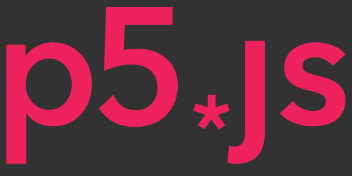

# Introducción a la Programación Creativa con p5.js

En este repositorio encontrarás toda la información necesaria para participar del taller **Introducción a la Programación Creativa con p5.js**.

## 📜Contenidos

- 🔍 [Información del Taller](#🔍-información-del-taller)
- 🎯 [Objetivo del Taller](#🎯-objetivo-del-taller)
- 📋 [Requisitos](#📋-requisitos)
- 📝 [Inscripción](#📝-inscripción)
- 📚 [Programa](#📚-programa)
- 💡 [Recursos](#💡-recursos)

## 🔍 Información del Taller

- **Duración:** 2 horas
- **Fecha y Hora:** 15 de Noviembre de 2023, 18:00 - 20:00
- **Lugar:** [Facultad de Artes, Universidad de Chile](https://maps.app.goo.gl/jWLTspcBS5QZggna6). Compañía 1264, Santiago de Chile. Sala Experimental (Segundo Piso)
- **Instructor:** [Patricio Isaías Céspedes](https://patricio-isaias.super.site/), Licenciado en Artes mención Composición Musical
- **Coste:** Actividad gratuita con inscripción previa

## 🎯 Objetivo del Taller

Este taller tiene como objetivo introducirte al mundo de la programación creativa utilizando la biblioteca [p5.js](https://p5js.org/es/). Aprenderás los fundamentos de la programación en JavaScript para crear dibujos interactivos y dinámicos. Al final del taller estarás familiarizado con las herramientas básicas de p5.js y habrás completado un proyecto práctico que podrás compartir en la web.

## 📋 Requisitos

- **Dispositivo:** Laptop con conexión a Internet.
- **Navegador Web:** Se recomienda [Google Chrome](https://www.google.com/intl/es_es/chrome/).
- **Editor de Código:** Se recomienda [Visual Studio Code](https://code.visualstudio.com/), pero cualquier editor de código es acceptable.
- **Nivel:** Principiantes, no se requieren conocimientos previos de programación.

_Nota: Asegúrate de tener Google Chrome instalado y tu editor de código configurado antes del taller._

## 📝 Inscripción

Para participar en este taller, sigue estos pasos:

1. Completa el [Formulario de Inscripción]() **antes del 14 de Noviembre de 2023.**
2. Una vez enviado el formulario, recibirás una **confirmación** por correo electrónico.
3. **Verifica tu correo electrónico** para asegurar tu participación.

## 📚 Programa

### Parte 1: Introducción a p5.js y Conceptos Básicos

#### Introducción al Taller (15 minutos)

- Presentación del instructor y sus proyectos.
- La programación creativa en el arte y diseño contemporáneo.
- Casos de estudio (artistas y proyectos).

#### Introducción a p5.js (30 minutos)

- Breve historia de p5.js como herramienta para aprender programación.
- Demostración del editor en línea y la interfaz de p5.js.
- Configuración del entorno de desarrollo en Visual Studio Code.
- Práctica guiada: Creación de un dibujo utilizando funciones básicas de p5.js (setup(), draw(), formas básicas, colores e interacción con mouse y teclado).
- Fundamentos de condicionales (if, else) y bucles (for, while).

#### ☕ Receso (10 minutos)

### Parte 2: Proyecto Práctico

#### Dibujo Interactivo con Condicionales y Loops (40 minutos)

- Creación de un dibujo interactivo con temática libre por parte de los participantes.
- Tiempo dedicado a la creación guiada y apoyo individual.

#### Revisión del Proyecto Práctico (15 minutos)

- Revisión y discusión de los proyectos realizados por los participantes.
- Instrucciones sobre cómo compartir un sketch de p5.js en línea.

#### Cierre y Retroalimentación (10 minutos)

- Recapitulación de los conceptos clave aprendidos durante el taller.
- Retroalimentación de los participantes, incluyendo aspectos positivos y áreas de mejora.
- Entrega de recursos adicionales.
- Invitación a los participantes a compartir sus proyectos con Generative Academy y ser parte de nuestra comunidad creativa.

## 💡 Recursos

- [Cheat Sheet de p5.js](/recursos/p5js-cheatsheet.png)
- [Tutoriales oficiales](https://p5js.org/es/learn/)
- [Generative Academy](https://www.instagram.com/generative.academy/)

¡Esperamos verte en el taller! ✨

Patricio Isaías © 2023
